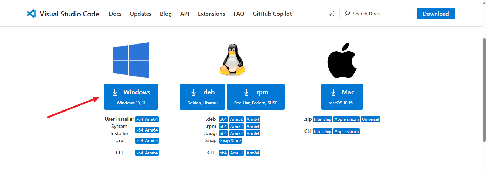

# tech-environment-setup
First Darey.io mini project

## TOOL INSTALLATION PROCESS
This project aims to show all the required tools and applications and their download and installation processes needed to be a successful DevOps engineer.

### VS CODE INSTALLATION
Visual Studio Code, commonly referred to as VS Code, is an integrated development environment developed by Microsoft for Windows, Linux, macOS and web browsers. Features include support for debugging, syntax highlighting, intelligent code completion, snippets, code refactoring, and embedded version control with Git. Users can change the theme, keyboard shortcuts and preferences, as well as install extensions that add functionality.

- VS CODE DOWNLOAD

- INSTALLED VS CODE 

## GIT INSTALLATION
- GIT DOWNLOAD

- GIT INSTALLED

## VIRTUAL BOX INSTALLATION
- Virtual Box Download

- Virtual Box Installed

## Ubuntu(Linux Distro) on Virtual Box (Windows Host)
- Ubuntu Download

- Ubuntu Installed in Virtual Box

## GitHub Account Creation
- GitHub Website SignUp

- GitHub Dashboard

## AWS Account Creation
- AWS website SignUp

- AWS management Console

- AWS Console Home

